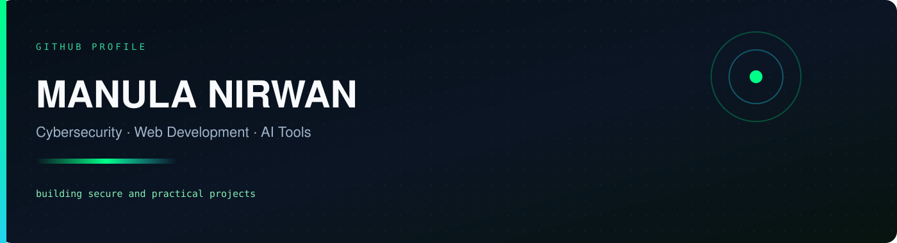
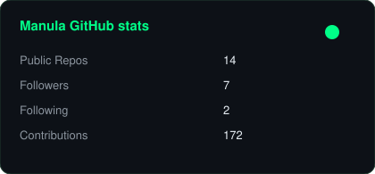
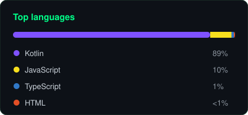

  

 

  

---

### About

Hi, I’m **Manula Nirwan**.

I work across **cybersecurity**, **web development**, and **AI tools**, with a focus on projects that can be used in the real world.

I learn by building, testing, researching, and publishing.

- Security research and defensive tooling
- Modern, responsive web apps
- Android apps and AI-assisted workflows
- Tutorials and technical content

---

### Featured projects

| Project | What it does | Live |
| :--- | :--- | :---: |
| [cyberlens](https://github.com/manulanirwan/cyberlens) | Domain and website exposure scanner with risk scoring and AI-assisted reports | — |
| [CyberLens-App](https://github.com/manulanirwan/CyberLens-App) | Android companion for defensive cybersecurity education | — |
| [Chat-With-All-AI-Models](https://github.com/manulanirwan/Chat-With-All-AI-Models) | Multi-model AI chat interface | [Demo](https://manulanirwan.github.io/Chat-With-All-AI-Models/) |
| [manula-ai-android-app](https://github.com/manulanirwan/manula-ai-android-app) | Gemini-powered Android assistant, including older devices | — |
| [manula-social-ai-android](https://github.com/manulanirwan/manula-social-ai-android) | Social content generator for major platforms | — |
| [manula-notebook-android](https://github.com/manulanirwan/manula-notebook-android) | Source-grounded AI research notebook | — |
| [hand-gesture-studio](https://github.com/manulanirwan/hand-gesture-studio) | Real-time MediaPipe Hands lab in the browser | [Demo](https://manulanirwan.github.io/hand-gesture-studio/) |
| [claude-skills](https://github.com/manulanirwan/claude-skills) | Reusable skills for study, content, and development | — |

---

### GitHub stats

  
  

 

  

 

  

---

### Tech stack

  

 

**AI**

**Ship**

---

### Connect

